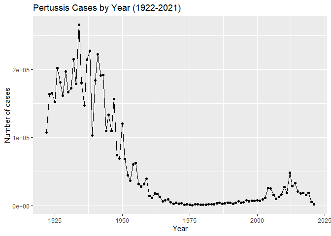
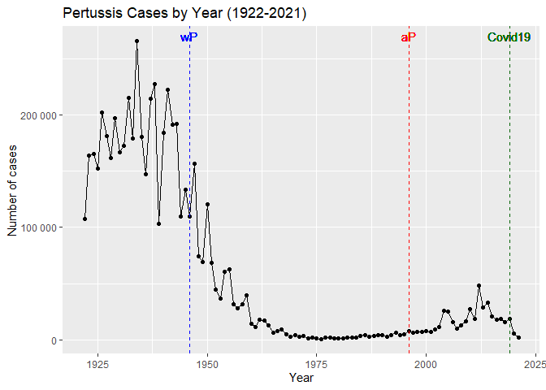
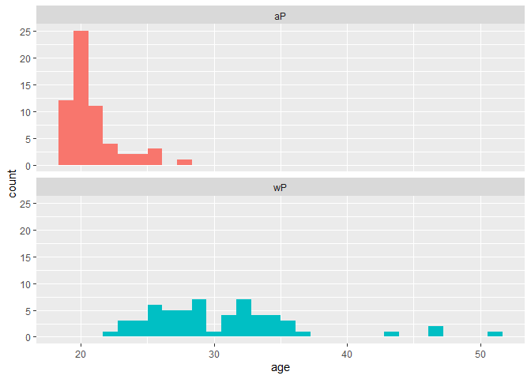
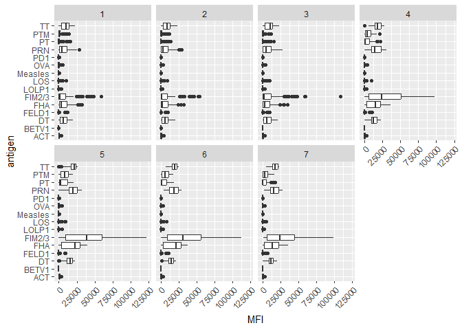
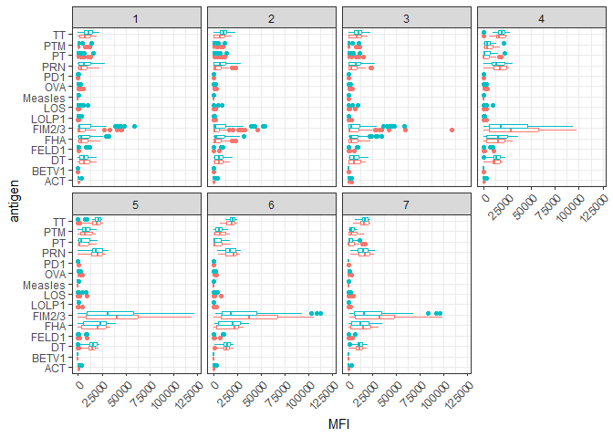
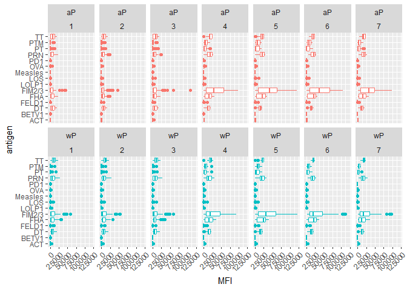
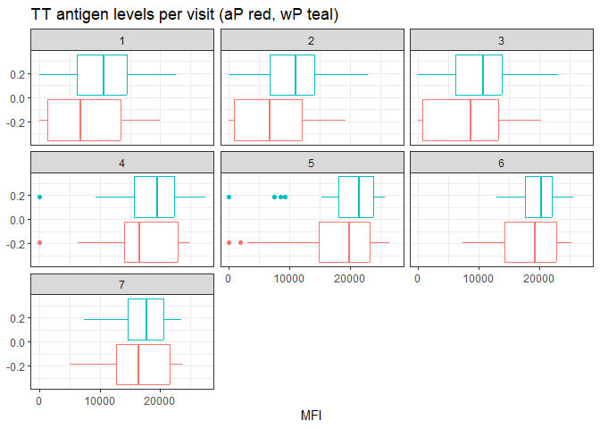
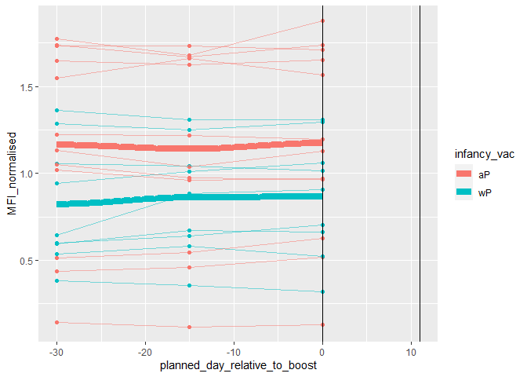

# Class19_Mini Project_Investigating Pertussis Resurgence
Changcheng (PID: A69027828)

Pertussis (more commonly known as whooping cough) is a highly contagious
respiratory disease caused by the bacterium Bordetella pertussis. People
of all ages can be infected leading to violent coughing fits followed by
a high-pitched intake of breath that sounds like “whoop”. Infants and
toddlers have the highest risk for severe complications and death.
Recent estimates from the WHO suggest that ~16 million cases and 200,000
infant deaths are due to pertussis annually 1.

1.  Investigating pertussis cases by year

``` r
#install.packages("datapasta")
library(datapasta)
```

> Q1. With the help of the R “addin” package datapasta assign the CDC
> pertussis case number data to a data frame called cdc and use ggplot
> to make a plot of cases numbers over time.

``` r
library(ggplot2)

pertucases <- ggplot(cdc) +
  aes(x = Year, y = No..Reported.Pertussis.Cases) +
  geom_point() +
  geom_line() +
  labs(title = "Pertussis Cases by Year (1922-2021)", 
       y = "Number of cases")

pertucases
```



2.  A tale of two vaccines (wP & aP)

> Q2. Using the ggplot geom_vline() function add lines to your previous
> plot for the 1946 introduction of the wP vaccine and the 1996 switch
> to aP vaccine (see example in the hint below). What do you notice?

``` r
pertucases + 
  geom_vline(xintercept=1946, linetype = 2, color = "blue") +
  geom_vline(xintercept=1996, linetype = 2, color = "red") +
  geom_vline(xintercept=2019, linetype = 2, color = "darkgreen") +
  geom_text(label="wP", x = 1946, y = 270000, color = "blue") +
  geom_text(label="aP", x = 1996, y = 270000, color = "red") +
  geom_text(label="Covid19", x = 2019, y = 270000, color = "darkgreen") +
  scale_y_continuous(labels = scales::number)
```



> Q3. Describe what happened after the introduction of the aP vaccine?
> Do you have a possible explanation for the observed trend?

Pertussis cases are increasing again after the introduction of aP
vaccine. A possible explanation is that Bordetella pertussis has evolved
to escape from vaccine immunity and we need novel types of vaccines.

3.  Exploring CMI-PB data

``` r
# Allows us to read, write and process JSON data
#install.packages("jsonlite")
library(jsonlite)
```

``` r
subject <- read_json("https://www.cmi-pb.org/api/subject", simplifyVector = TRUE) 
```

``` r
head(subject, 3)
```

      subject_id infancy_vac biological_sex              ethnicity  race
    1          1          wP         Female Not Hispanic or Latino White
    2          2          wP         Female Not Hispanic or Latino White
    3          3          wP         Female                Unknown White
      year_of_birth date_of_boost      dataset
    1    1986-01-01    2016-09-12 2020_dataset
    2    1968-01-01    2019-01-28 2020_dataset
    3    1983-01-01    2016-10-10 2020_dataset

> Q4. How many aP and wP infancy vaccinated subjects are in the dataset?

``` r
table(subject$infancy_vac)
```


    aP wP 
    60 58 

There are 60 aP and 58 wP infancy vaccinated subjects

> Q5. How many Male and Female subjects/patients are in the dataset?

``` r
table(subject$biological_sex) 
```


    Female   Male 
        79     39 

There are 39 Males and 79 Females

> Q6. What is the breakdown of race and biological sex (e.g. number of
> Asian females, White males etc…)?

``` r
table(subject$biological_sex, subject$race)
```

            
             American Indian/Alaska Native Asian Black or African American
      Female                             0    21                         2
      Male                               1    11                         0
            
             More Than One Race Native Hawaiian or Other Pacific Islander
      Female                  9                                         1
      Male                    2                                         1
            
             Unknown or Not Reported White
      Female                      11    35
      Male                         4    20

> Q, Make a histogram of the subject age distribution and facet by
> infancy_vac

Side-Note: Working with dates


    载入程辑包：'lubridate'

    The following objects are masked from 'package:base':

        date, intersect, setdiff, union

``` r
today()
```

    [1] "2023-12-10"

``` r
today() - ymd("2000-01-01")
```

    Time difference of 8744 days

``` r
time_length(today() - ymd("2000-01-01"), "years")
```

    [1] 23.93977

> Q7. Using this approach determine (i) the average age of wP
> individuals, (ii) the average age of aP individuals; and (iii) are
> they significantly different?

1)  

``` r
subwP <- subject$infancy_vac == "wP"
subAge <- time_length(today() - ymd(subject$year_of_birth), "years")
AvgwPAge <- sum(subwP * subAge) / sum(subwP)
AvgwPAge
```

    [1] 36.33525

The average age of wP individuals is 36.3 years.

2)  

``` r
subaP <- subject$infancy_vac == "aP"
subAge <- time_length(today() - ymd(subject$year_of_birth), "years")
AvgaPAge <- sum(subaP * subAge) / sum(subaP)
AvgaPAge
```

    [1] 26.03851

The average age of wP individuals is 26.0 years.

``` r
wP1 <- subwP * subAge
aP1 <- subaP * subAge
wPAge <- wP1[which(wP1 != 0)]
aPAge <- aP1[which(aP1 != 0)]
t.test(wPAge, aPAge)
```


        Welch Two Sample t-test

    data:  wPAge and aPAge
    t = 12.436, df = 65.411, p-value < 2.2e-16
    alternative hypothesis: true difference in means is not equal to 0
    95 percent confidence interval:
      8.643385 11.950080
    sample estimates:
    mean of x mean of y 
     36.33525  26.03851 

There is a significant difference.

> Q8. Determine the age of all individuals at time of boost?

``` r
boostAge <- time_length(ymd(subject$date_of_boost) - ymd(subject$year_of_birth), "years")
boostAge
```

      [1] 30.69678 51.07461 33.77413 28.65982 25.65914 28.77481 35.84942 34.14921
      [9] 20.56400 34.56263 30.65845 34.56263 19.56194 23.61944 27.61944 29.56331
     [17] 36.69815 19.65777 22.73511 35.65777 33.65914 31.65777 25.73580 24.70089
     [25] 28.70089 33.73580 19.73443 34.73511 19.73443 28.73648 27.73443 19.81109
     [33] 26.77344 33.81246 25.77413 19.81109 18.85010 19.81109 31.81109 22.81177
     [41] 31.84942 19.84942 18.85010 18.85010 19.90691 18.85010 20.90897 19.04449
     [49] 20.04381 19.90691 19.90691 19.00616 19.00616 20.04381 20.04381 20.07940
     [57] 21.08145 20.07940 20.07940 20.07940 32.26557 25.90007 23.90144 25.90007
     [65] 28.91992 42.92129 47.07461 47.07461 29.07324 21.07324 21.07324 28.15058
     [73] 24.15058 24.15058 21.14990 21.14990 31.20876 26.20671 32.20808 27.20876
     [81] 26.20671 21.20739 20.26557 22.26420 19.32375 21.32238 19.32375 19.32375
     [89] 22.41752 20.41889 21.41821 19.47707 23.47707 20.47639 21.47570 19.47707
     [97] 35.90965 28.73648 22.68309 20.83231 18.83368 18.83368 27.68241 32.68172
    [105] 27.68241 25.68378 23.68241 26.73785 32.73648 24.73648 25.79603 25.79603
    [113] 25.79603 31.79466 19.83299 21.91102 27.90965 24.06297

> Q9. With the help of a faceted boxplot or histogram (see below), do
> you think these two groups are significantly different?

``` r
subject$age <- boostAge

ggplot(subject) +
  aes(x = age,
      fill=as.factor(infancy_vac)) +
  geom_histogram(show.legend=FALSE) +
  facet_wrap(vars(infancy_vac), nrow=2, ncol =1) 
```

    `stat_bin()` using `bins = 30`. Pick better value with `binwidth`.



It seems these two groups are significantly different.

There are 3 main datasets in the CMI-PB project at the time of writing,

``` r
table(subject$dataset)
```


    2020_dataset 2021_dataset 2022_dataset 
              60           36           22 

Joining multiple tables

``` r
# Complete the API URLs...
specimen <- read_json("https://www.cmi-pb.org/api/specimen", simplifyVector = TRUE) 
titer <- read_json("https://www.cmi-pb.org/api/plasma_ab_titer", simplifyVector = TRUE)
```

``` r
head(specimen)
```

      specimen_id subject_id actual_day_relative_to_boost
    1           1          1                           -3
    2           2          1                            1
    3           3          1                            3
    4           4          1                            7
    5           5          1                           11
    6           6          1                           32
      planned_day_relative_to_boost specimen_type visit
    1                             0         Blood     1
    2                             1         Blood     2
    3                             3         Blood     3
    4                             7         Blood     4
    5                            14         Blood     5
    6                            30         Blood     6

``` r
head(titer)
```

      specimen_id isotype is_antigen_specific antigen        MFI MFI_normalised
    1           1     IgE               FALSE   Total 1110.21154       2.493425
    2           1     IgE               FALSE   Total 2708.91616       2.493425
    3           1     IgG                TRUE      PT   68.56614       3.736992
    4           1     IgG                TRUE     PRN  332.12718       2.602350
    5           1     IgG                TRUE     FHA 1887.12263      34.050956
    6           1     IgE                TRUE     ACT    0.10000       1.000000
       unit lower_limit_of_detection
    1 UG/ML                 2.096133
    2 IU/ML                29.170000
    3 IU/ML                 0.530000
    4 IU/ML                 6.205949
    5 IU/ML                 4.679535
    6 IU/ML                 2.816431

I want to merge(join) the specimen and subject tables together

> Q9. Complete the code to join specimen and subject tables to make a
> new merged data frame containing all specimen records along with their
> associated subject details:

``` r
#install.packages("dplyr")
library(dplyr)
```


    载入程辑包：'dplyr'

    The following objects are masked from 'package:stats':

        filter, lag

    The following objects are masked from 'package:base':

        intersect, setdiff, setequal, union

``` r
meta <- inner_join(specimen, subject)
```

    Joining with `by = join_by(subject_id)`

``` r
dim(meta)
```

    [1] 939  14

``` r
head(meta)
```

      specimen_id subject_id actual_day_relative_to_boost
    1           1          1                           -3
    2           2          1                            1
    3           3          1                            3
    4           4          1                            7
    5           5          1                           11
    6           6          1                           32
      planned_day_relative_to_boost specimen_type visit infancy_vac biological_sex
    1                             0         Blood     1          wP         Female
    2                             1         Blood     2          wP         Female
    3                             3         Blood     3          wP         Female
    4                             7         Blood     4          wP         Female
    5                            14         Blood     5          wP         Female
    6                            30         Blood     6          wP         Female
                   ethnicity  race year_of_birth date_of_boost      dataset
    1 Not Hispanic or Latino White    1986-01-01    2016-09-12 2020_dataset
    2 Not Hispanic or Latino White    1986-01-01    2016-09-12 2020_dataset
    3 Not Hispanic or Latino White    1986-01-01    2016-09-12 2020_dataset
    4 Not Hispanic or Latino White    1986-01-01    2016-09-12 2020_dataset
    5 Not Hispanic or Latino White    1986-01-01    2016-09-12 2020_dataset
    6 Not Hispanic or Latino White    1986-01-01    2016-09-12 2020_dataset
           age
    1 30.69678
    2 30.69678
    3 30.69678
    4 30.69678
    5 30.69678
    6 30.69678

> Q10. Now using the same procedure join meta with titer data so we can
> further analyze this data in terms of time of visit aP/wP, male/female
> etc.

``` r
abdata <- inner_join(titer, meta)
```

    Joining with `by = join_by(specimen_id)`

``` r
dim(abdata)
```

    [1] 41810    21

``` r
oops <- abdata %>% filter(antigen == "FIM2/3")
table(oops$dataset)
```


    2020_dataset 2021_dataset 2022_dataset 
            1970         1155          315 

``` r
table(abdata$dataset)
```


    2020_dataset 2021_dataset 2022_dataset 
           31520         8085         2205 

> Q11. How many specimens (i.e. entries in abdata) do we have for each
> isotype?

``` r
table(abdata$isotype)
```


     IgE  IgG IgG1 IgG2 IgG3 IgG4 
    6698 3240 7968 7968 7968 7968 

> Q12. What do you notice about the number of visit 8 specimens compared
> to other visits?

``` r
table(abdata$visit)
```


       1    2    3    4    5    6    7    8 
    6390 6460 6530 5900 5900 5475 5075   80 

Number of visit 8 specimens is very small compared to other visits.

4.  Examine IgG1 Ab titer levels

``` r
ig1 <- abdata %>% filter(isotype == "IgG1", visit!=8)
head(ig1)
```

      specimen_id isotype is_antigen_specific antigen        MFI MFI_normalised
    1           1    IgG1                TRUE     ACT 274.355068      0.6928058
    2           1    IgG1                TRUE     LOS  10.974026      2.1645083
    3           1    IgG1                TRUE   FELD1   1.448796      0.8080941
    4           1    IgG1                TRUE   BETV1   0.100000      1.0000000
    5           1    IgG1                TRUE   LOLP1   0.100000      1.0000000
    6           1    IgG1                TRUE Measles  36.277417      1.6638332
       unit lower_limit_of_detection subject_id actual_day_relative_to_boost
    1 IU/ML                 3.848750          1                           -3
    2 IU/ML                 4.357917          1                           -3
    3 IU/ML                 2.699944          1                           -3
    4 IU/ML                 1.734784          1                           -3
    5 IU/ML                 2.550606          1                           -3
    6 IU/ML                 4.438966          1                           -3
      planned_day_relative_to_boost specimen_type visit infancy_vac biological_sex
    1                             0         Blood     1          wP         Female
    2                             0         Blood     1          wP         Female
    3                             0         Blood     1          wP         Female
    4                             0         Blood     1          wP         Female
    5                             0         Blood     1          wP         Female
    6                             0         Blood     1          wP         Female
                   ethnicity  race year_of_birth date_of_boost      dataset
    1 Not Hispanic or Latino White    1986-01-01    2016-09-12 2020_dataset
    2 Not Hispanic or Latino White    1986-01-01    2016-09-12 2020_dataset
    3 Not Hispanic or Latino White    1986-01-01    2016-09-12 2020_dataset
    4 Not Hispanic or Latino White    1986-01-01    2016-09-12 2020_dataset
    5 Not Hispanic or Latino White    1986-01-01    2016-09-12 2020_dataset
    6 Not Hispanic or Latino White    1986-01-01    2016-09-12 2020_dataset
           age
    1 30.69678
    2 30.69678
    3 30.69678
    4 30.69678
    5 30.69678
    6 30.69678

> Q13. Complete the following code to make a summary boxplot of Ab titer
> levels (MFI) for all antigens:

``` r
ggplot(ig1) +
  aes(x = MFI, antigen) +
  geom_boxplot() + 
  facet_wrap(vars(visit), nrow=2) +
  theme(axis.text.x = element_text(angle = 45, hjust=1))
```



> Q14. What antigens show differences in the level of IgG1 antibody
> titers recognizing them over time? Why these and not others?

FIM2/3 showed greatest difference in the level of IgG1 antibody titers
recognizing it over time. TT, PRN, FHA and DT also showed differences.

``` r
ggplot(ig1) +
  aes(MFI, antigen, col=infancy_vac ) +
  geom_boxplot(show.legend = FALSE) + 
  facet_wrap(vars(visit), nrow=2) +
  theme_bw() +
  theme(axis.text.x = element_text(angle = 45, hjust=1))
```



``` r
ggplot(ig1) +
  aes(MFI, antigen, col=infancy_vac ) +
  geom_boxplot(show.legend = FALSE) + 
  facet_wrap(vars(infancy_vac, visit), nrow=2) +
  theme(axis.text.x = element_text(angle = 45, hjust=1))
```



> Q15. Filter to pull out only two specific antigens for analysis and
> create a boxplot for each. You can chose any you like. Below I picked
> a “control” antigen (“Measles”, that is not in our vaccines) and a
> clear antigen of interest (“FIM2/3”, extra-cellular fimbriae proteins
> from B. pertussis that participate in substrate attachment).

``` r
filter(ig1, antigen=="TT") %>%
  ggplot() +
  aes(MFI, col=infancy_vac) +
  geom_boxplot(show.legend = FALSE) +
  facet_wrap(vars(visit)) +
  theme_bw() +
  labs(title = "TT antigen levels per visit (aP red, wP teal)")
```



``` r
filter(ig1, antigen=="FIM2/3") %>%
  ggplot() +
  aes(MFI, col=infancy_vac) +
  geom_boxplot(show.legend = FALSE) +
  facet_wrap(vars(visit)) +
  theme_bw() +
  labs(title = "FIM2/3 antigen levels per visit (aP red, wP teal)")
```


> Q16. What do you notice about these two antigens time courses and the
> FIM2/3 data in particular?

They all appear to peak at around visit 5/6 and then decline. FIM2/3
levels clearly rise over time and far exceed those of TT.

> Q17. Do you see any clear difference in aP vs. wP responses?

There is no obvious difference in aP vs. wP responses.

5.  Obtaining CMI-PB RNASeq data

``` r
url <- "https://www.cmi-pb.org/api/v2/rnaseq?versioned_ensembl_gene_id=eq.ENSG00000211896.7"

rna <- read_json(url, simplifyVector = TRUE) 
```

``` r
#meta <- inner_join(specimen, subject)
ssrna <- inner_join(rna, meta)
```

    Joining with `by = join_by(specimen_id)`

> Q18. Make a plot of the time course of gene expression for IGHG1 gene
> (i.e. a plot of visit vs. tpm).

``` r
ggplot(ssrna) +
  aes(visit, tpm, group=subject_id) +
  geom_point() +
  geom_line(alpha=0.2)
```


Select (or filter) for the 2021 dataset and isotype IgG I want a time
course(“planned_day_relative_to_boost”) of IgG MFI_normalized for “PT”
antigen.

``` r
abdata$planned_day_relative_to_boost 
```

``` r
igpt.21 <- abdata  %>%  
  filter(dataset == "2021_dataset", isotype == "IgG", antigen == "PT")
```

``` r
ggplot(igpt.21) +
  aes(planned_day_relative_to_boost,
      MFI_normalised,
      col = infancy_vac) +
  geom_point() +
  geom_line(aes(group = subject_id), linewidth = 0.5, alpha = 0.5) +
  geom_smooth(se = FALSE, span = 0.4, linewidth = 3)
```

    `geom_smooth()` using method = 'loess' and formula = 'y ~ x'

    Warning in simpleLoess(y, x, w, span, degree = degree, parametric = parametric,
    : pseudoinverse used at -0.6

    Warning in simpleLoess(y, x, w, span, degree = degree, parametric = parametric,
    : neighborhood radius 3.6

    Warning in simpleLoess(y, x, w, span, degree = degree, parametric = parametric,
    : reciprocal condition number 1.8382e-16

    Warning in simpleLoess(y, x, w, span, degree = degree, parametric = parametric,
    : There are other near singularities as well. 11364

    Warning in simpleLoess(y, x, w, span, degree = degree, parametric = parametric,
    : pseudoinverse used at -0.6

    Warning in simpleLoess(y, x, w, span, degree = degree, parametric = parametric,
    : neighborhood radius 3.6

    Warning in simpleLoess(y, x, w, span, degree = degree, parametric = parametric,
    : reciprocal condition number 1.4316e-16

    Warning in simpleLoess(y, x, w, span, degree = degree, parametric = parametric,
    : There are other near singularities as well. 11364


For 2022 dataset

``` r
igpt.22 <- abdata  %>%  
  filter(dataset == "2022_dataset", isotype == "IgG", antigen == "PT")
```

``` r
ggplot(igpt.22) +
  aes(planned_day_relative_to_boost,
      MFI_normalised,
      col = infancy_vac) +
  geom_point() +
  geom_line(aes(group = subject_id), linewidth = 0.5, alpha = 0.5) +
  geom_smooth(se = FALSE, span = 0.4, linewidth = 3) +
  geom_vline(xintercept = 0) +
  geom_vline(xintercept = 11)
```

    `geom_smooth()` using method = 'loess' and formula = 'y ~ x'

    Warning in simpleLoess(y, x, w, span, degree = degree, parametric = parametric,
    : pseudoinverse used at -30.15

    Warning in simpleLoess(y, x, w, span, degree = degree, parametric = parametric,
    : neighborhood radius 15.15

    Warning in simpleLoess(y, x, w, span, degree = degree, parametric = parametric,
    : reciprocal condition number 0

    Warning in simpleLoess(y, x, w, span, degree = degree, parametric = parametric,
    : There are other near singularities as well. 229.52

    Warning in simpleLoess(y, x, w, span, degree = degree, parametric = parametric,
    : pseudoinverse used at -30.15

    Warning in simpleLoess(y, x, w, span, degree = degree, parametric = parametric,
    : neighborhood radius 15.15

    Warning in simpleLoess(y, x, w, span, degree = degree, parametric = parametric,
    : reciprocal condition number 0

    Warning in simpleLoess(y, x, w, span, degree = degree, parametric = parametric,
    : There are other near singularities as well. 229.52




    >Q19.: What do you notice about the expression of this gene (i.e. when is it at it’s maximum level)?

    It increases and reaches it's maximum level at visit 4 and decreases after that.

    >Q20. Does this pattern in time match the trend of antibody titer data? If not, why not?

    It does not perfectly match the antibody titer trend (maximum at visit 5).
    There is a time lag between the increase of IgG1 transcript level and the increase of IgG1 Antibody. Translation takes time.

    ::: {.cell}

    ```{.r .cell-code}
    ggplot(ssrna) +
      aes(tpm, col=infancy_vac) +
      geom_boxplot() +
      facet_wrap(vars(visit))

<div class="cell-output-display">


</div>

:::

``` r
ssrna %>%  
  filter(visit==4) %>% 
  ggplot() +
    aes(tpm, col=infancy_vac) + geom_density() + 
    geom_rug() 
```


6.  Working with larger datasets

``` r
# Change for your downloaded file path
rnaseq <- read.csv("2020LD_rnaseq.csv")

head(rnaseq,3)
```

      versioned_ensembl_gene_id specimen_id raw_count tpm
    1         ENSG00000229704.1         209         0   0
    2         ENSG00000229707.1         209         0   0
    3         ENSG00000229708.1         209         0   0

``` r
dim(rnaseq)
```

    [1] 10502460        4

Working with long format data

``` r
n_genes <- table(rnaseq$specimen_id)
head( n_genes , 10)
```


        1     3     4     5     6    19    20    21    22    23 
    58347 58347 58347 58347 58347 58347 58347 58347 58347 58347 

How many specimens

``` r
length(n_genes)
```

    [1] 180

Check if there are the same number of genes for each specimen

``` r
all(n_genes[1]==n_genes)
```

    [1] TRUE

Convert to “wide” format

``` r
#install.packages("tidyr")
library(tidyr)

rna_wide <- rnaseq %>% 
  select(versioned_ensembl_gene_id, specimen_id, tpm) %>%
  pivot_wider(names_from = specimen_id, values_from=tpm)

dim(rna_wide)
```

    [1] 58347   181

``` r
head(rna_wide[,1:7], 3)
```

    # A tibble: 3 × 7
      versioned_ensembl_gene_id `209`  `74` `160`  `81` `102` `163`
      <chr>                     <dbl> <dbl> <dbl> <dbl> <dbl> <dbl>
    1 ENSG00000229704.1             0     0     0     0     0     0
    2 ENSG00000229707.1             0     0     0     0     0     0
    3 ENSG00000229708.1             0     0     0     0     0     0
